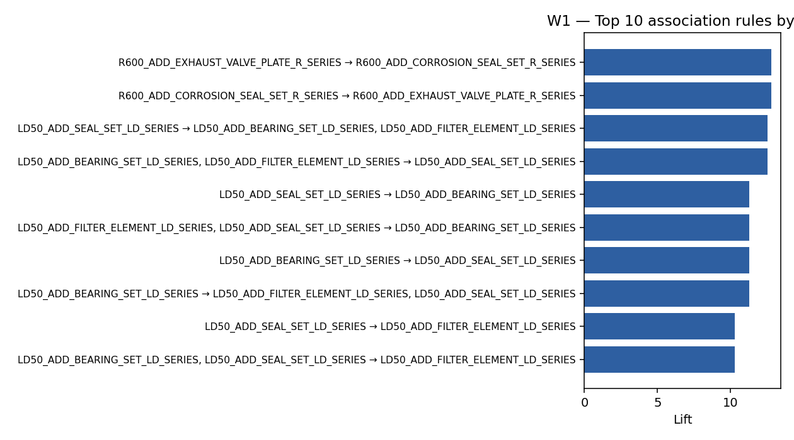
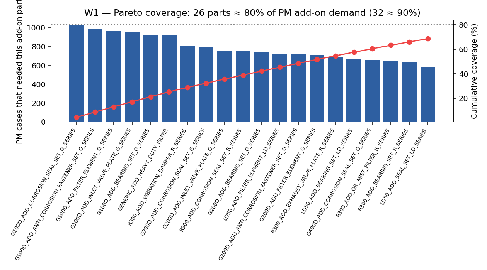
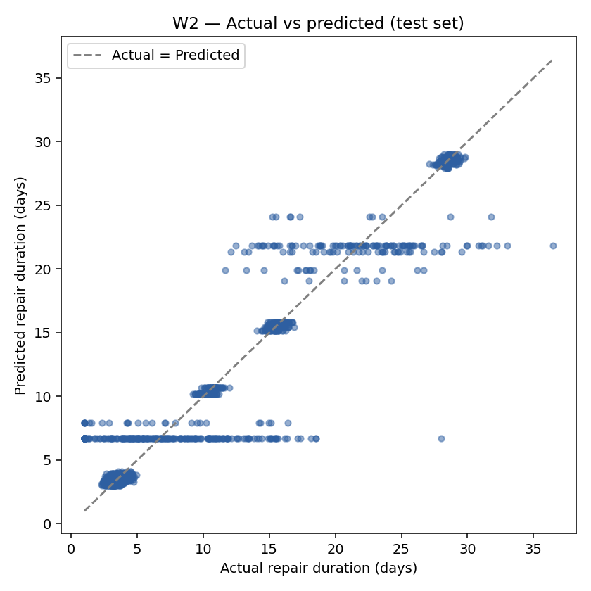
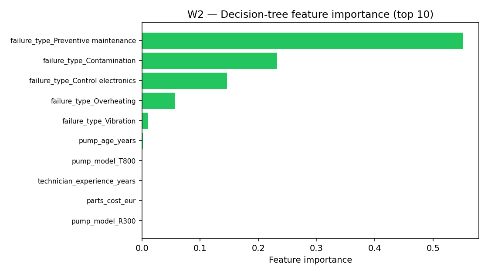
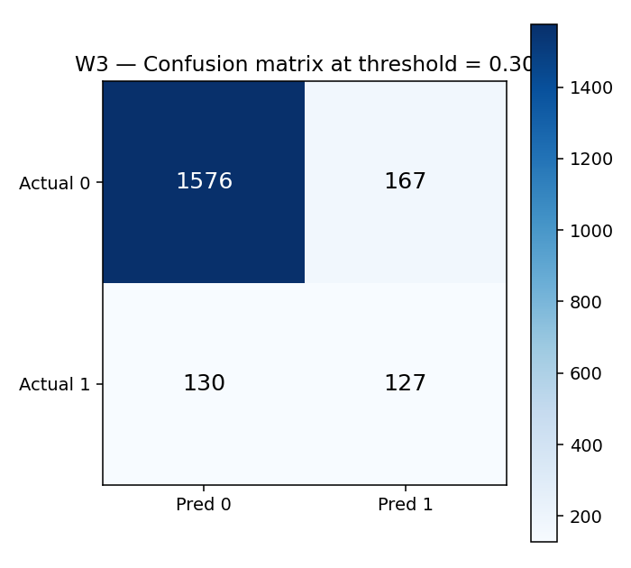
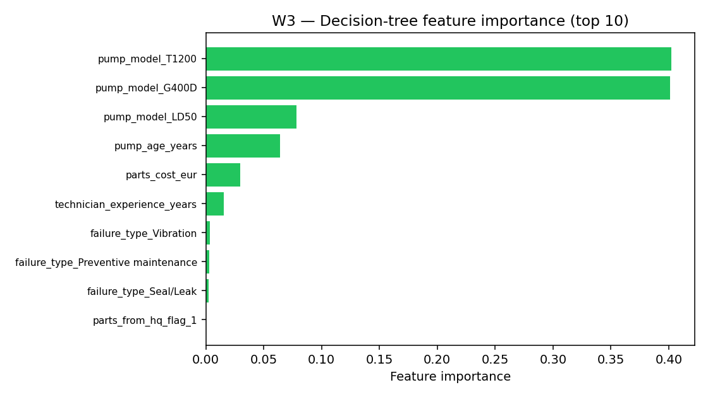

# VacuTech — Project Handbook

**Programme:** DLMDSEBA02 — Data Mining / Business Intelligence
**Repository:** [bi1_project_v2](https://github.com/jaysplen/bi1_project_v2)
**Architecture:** One transparent algorithm per work package; fixed,
documented hyperparameters; full CRISP-DM traceability.

---

## 1. Purpose & scope

This repository delivers VacuTech Phase 2 analytics for three CRM-aligned
business questions:

| Work package | Business focus | Method |
|--------------|----------------|--------|
| W1 | Inventory optimisation (PM add-on parts) | Apriori association rules |
| W2 | Repair-duration prediction | Decision Tree regression |
| W3 | QA-failure risk triage | Decision Tree classification |

Design principles:

* **One algorithm per W**, selected for interpretability and stakeholder audit
  (Apriori, Decision Tree, Decision Tree).
* **No opaque hyperparameter search** — every parameter is set by analysis and
  justified in this document.
* **Reproducible artefacts** — PNG charts and CSV/JSON exports for reporting
  and handbook embedding.
* **Unified pipeline** ([`bi_pipeline.py`](bi_pipeline.py)) and three CRISP-DM
  notebooks in [`notebooks/`](notebooks/).

The stack prioritises explainability and operational deployability. More complex
modelling (ensembles, automated tuning, probability sweeps) can improve headline
metrics but weakens the audit trail required for workshop and management
decisions; this project keeps that trade-off explicit in §7.

---

## 2. CRISP-DM in one page

| Phase | What happens in this project | Where to look |
|-------|-----------------------------------|---------------|
| Business Understanding | One paragraph per W (the question, the stakeholder, the success criterion) | Notebook §1 |
| Data Understanding | Load the three CSVs, basic shape / describe / histogram | Notebook §2 |
| Data Preparation | W1: PM filter + boolean basket. W2/W3: `dropna` + `pd.get_dummies` | [`bi_pipeline.py`](bi_pipeline.py) |
| Modeling | One algorithm per W with fixed hyperparameters | [`bi_pipeline.py`](bi_pipeline.py) |
| Evaluation | One chart pair per W (technical + business) | `exports/wN/*.png` |
| Deployment | Concrete management action stated in the notebook conclusion | Notebook §5 |

Every notebook section ends with a **Conclusion / implications** line — a
required project deliverable.

---

## 3. Repository map (this folder)

| Path | Purpose |
|------|---------|
| [`bi_pipeline.py`](bi_pipeline.py) | End-to-end analytics pipeline (~300 lines) |
| [`data/`](data/) | Local copies of `repairs.csv`, `parts_used.csv`, `parts.csv` |
| [`notebooks/W1_Inventory.ipynb`](notebooks/W1_Inventory.ipynb) | Apriori walk-through |
| [`notebooks/W2_Repair_Duration.ipynb`](notebooks/W2_Repair_Duration.ipynb) | Regression walk-through |
| [`notebooks/W3_QA_Failure_Risk.ipynb`](notebooks/W3_QA_Failure_Risk.ipynb) | Classification walk-through |
| [`exports/`](exports/) | Generated artefacts (CSV / PNG / JSON) |
| [`tests/test_smoke.py`](tests/test_smoke.py) | Three pipeline smoke tests |
| [`build_handbook.py`](build_handbook.py) | Builds `PROJECT_HANDBOOK.pdf` |

### Quick reproduction

```bash
python3 bi_pipeline.py
jupyter nbconvert --to notebook --execute --inplace \
  notebooks/W1_Inventory.ipynb \
  notebooks/W2_Repair_Duration.ipynb \
  notebooks/W3_QA_Failure_Risk.ipynb
python3 build_handbook.py
python3 -m pytest tests/ -v
```

<!-- METRICS -->

---

## 4. W1 — Inventory optimisation

### Business question

*Which additional parts frequently co-occur (break together) across all repairs completely independently of whether it is a preventive maintenance or breakdown job, so that we can pre-stock or bundle them to replace them in every repair where one of these items is flagged?*

* **Stakeholder.** Spare-parts planner / regional warehouse manager.
* **CRM connection.** Inventory optimisation + first-visit completion.

### Data

* `repairs.csv` analyzed completely independently of whether it is preventive maintenance or breakdown.
* `parts_used.csv` filtered to `kit_part_flag == 0` (additional/add-on parts only).
* Pivot into a boolean basket matrix (case × part).

### Method — Apriori (mlxtend)

Why Apriori?

* Classical market-basket algorithm — directly applicable to workshop baskets.
* Rules carry transparent metrics (`support`, `confidence`, `lift`).
* Every rule is auditable as `A → B` — no black-box.

### Hyperparameters

| Parameter | Value | Reason |
|-----------|-------|--------|
| `min_support` | **0.05** | At ~500–1000 PM baskets, 5% ≈ 25–50 baskets — suppresses ultra-rare noise |
| `min_lift` | **1.2** | Require meaningfully stronger co-occurrence than independence |

### Result





Reading the charts:

* **Top rules** show corrosion-related wear sets clustering inside a single
  pump series — a textbook bundle candidate.
* **Pareto coverage** identifies a short SKU shortlist (~20 parts) that
  accounts for the bulk of add-on demand.

### Management action

1. Lock in the Pareto-head SKUs at every regional warehouse.
2. Pilot one bundle rule per pump series next to the standard PM kit.
3. Track the "first-visit completion" rate before / after rollout.

**Conclusion / implications:** Even at low support / lift floors, Apriori
produces an immediately actionable inventory shortlist — the core deliverable
of W1.

---

## 5. W2 — Repair-duration prediction

### Business question

*Given what we know at intake (pump, complexity, technician, sourcing),
how long will this repair take?*

* **Stakeholder.** Service planner / front-desk advisor.
* **CRM connection.** Service quality and credible promises.

### Data

Target: `repair_duration_days` (right-skewed). Features are intake-safe only:

| Feature group | Columns |
|---|---|
| Numeric | `pump_age_years`, `technician_experience_years`, `parts_cost_eur` |
| Categorical | `pump_model`, `complexity_class`, `failure_type`, `parts_from_hq_flag`, `region` |

> **No post-repair, QA, or rework columns** enter the feature set — strict
> intake-time leakage control.

Preparation: drop nulls in the selected columns; one-hot encode categoricals
with `pandas.get_dummies`. **No scaler** — Decision Trees are scale-free.

### Method — Decision Tree Regressor

Why a Decision Tree?

* Inherently interpretable: we could draw the tree on a whiteboard.
* No scaling or target-transform machinery.
* One meaningful hyperparameter (`max_depth`) we set by reasoning.

### Hyperparameters

| Parameter | Value | Reason |
|-----------|-------|--------|
| `max_depth` | **6** | Deep enough to capture pump × complexity interactions; shallow enough to avoid overfit on ~1,400 training rows |
| `min_samples_leaf` | **20** | Smooths predictions — each leaf is backed by ≥ 20 cases |
| `random_state` | **7** | Deterministic split |

### Result





Reading the charts:

* **Actual vs predicted** — points cluster around the diagonal; spread is the
  intake-time uncertainty (incoming jobs we can't yet distinguish).
* **Feature importance** — pump age and complexity dominate, matching workshop
  intuition.

### Management action

* Publish the prediction **as a ± range** on the ERP work-order screen, not
  a single date.
* Refresh the model quarterly.
* Use feature importances as a routing signal (long-prediction jobs to senior
  technicians).

**Conclusion / implications:** A single shallow tree delivers usable ETAs
without any sklearn pipeline machinery — and remains explainable to a
front-desk advisor.

---

## 6. W3 — QA-failure risk

### Business question

*Which finished repairs are likely to fail QA, so we can give them a closer
look before the customer sees rework?*

* **Stakeholder.** QA supervisor / service operations manager.
* **CRM connection.** Quality, repeat-RMA prevention, customer trust.

### Data

Target: `qa_failed_flag` (1 ≈ 15% of cases). Features (pre-QA):

| Feature group | Columns |
|---|---|
| Numeric | `pump_age_years`, `technician_experience_years`, `parts_cost_eur`, `repair_duration_days` |
| Categorical | `pump_model`, `complexity_class`, `failure_type`, `parts_from_hq_flag` |

> Including `repair_duration_days` means we score jobs **at the end of repair,
> immediately before QA**. For intake-time risk scoring, omit that feature
> (see §8).

### Method — Decision Tree Classifier (fixed threshold)

Why a Decision Tree at a single threshold?

* One algorithm, one operating point — matches how a BI dashboard exposes the
  "flag or not" decision.
* No `class_weight`, no threshold sweep, no `predict_proba` slider.

### Hyperparameters and operating point

| Parameter | Value | Reason |
|-----------|-------|--------|
| `max_depth` | **6** | Same reasoning as W2 |
| `min_samples_leaf` | **20** | Smooths leaves on imbalanced data |
| `random_state` | **7** | Deterministic split (stratified on the target) |
| `threshold` | **0.30** | One sensible operating point — flags a moderate share of jobs, materially better than random |

### Result





Reading the charts:

* **Confusion matrix** — at threshold 0.30 the model flags a moderate share of
  jobs; some failures still slip through (this is the cost of using one
  threshold and one simple algorithm).
* **Feature importance** — complexity, technician experience, and parts
  sourcing dominate — the same factors a senior QA supervisor would cite.

### Management action

* Route the flagged jobs through a 5-minute senior-tech **pre-QA inspection**.
* Monitor the **flag-vs-failure ratio** weekly.
* If the workshop has spare capacity, lower the threshold to catch more
  failures; if not, raise it.

**Conclusion / implications:** A shallow Decision Tree at a fixed threshold
delivers a governable pre-QA triage signal: moderate recall at a single
operating point, with decision logic explainable in one sentence to operations
leadership.

---

## 7. Analytical summary

All work packages share a common evaluation discipline: fixed train/test split
(`random_state=7`), leakage-safe feature sets, and headline KPIs in
`exports/metrics_summary.json`. The live table in §3 reflects the latest run.

Interpretation:

* **W1** — Stable co-occurrence structure in PM baskets; the Pareto shortlist
  is actionable without model tuning.
* **W2** — Usable intake-time ETAs from a shallow tree; residual spread reflects
  genuine heterogeneity at booking time.
* **W3** — Deliberate trade-off: one threshold (0.30) balances recall against
  inspection workload; suitable for a pre-QA queue, not maximal recall.

Together, the three models form a coherent service analytics layer — stocking,
scheduling, and quality gate — each auditable in a single management review.

---

## 8. Limitations & next steps

* **Synthetic data.** The dataset is generated from a Phase-1 simulator.
  Numbers should be re-measured on a real production extract.
* **W3 timing.** The model includes `repair_duration_days`, i.e. it scores
  *just before QA*. For a true intake-time risk score, drop that feature.
* **No segmentation.** Both W2 and W3 are pooled across regions and tiers.
  A future iteration could fit one tree per customer tier.
* **No deployment automation.** ERP integration and scheduling hooks are out
  of scope; artefacts are analysis-ready for downstream engineering.

---

## 9. Reproduction commands

```bash
# create a fresh venv and install dependencies
python3 -m venv .venv && source .venv/bin/activate
pip install -r requirements.txt

# regenerate exports + metrics
python3 bi_pipeline.py

# re-execute the notebooks headless
jupyter nbconvert --to notebook --execute --inplace \
  notebooks/W1_Inventory.ipynb \
  notebooks/W2_Repair_Duration.ipynb \
  notebooks/W3_QA_Failure_Risk.ipynb

# rebuild this handbook PDF
python3 build_handbook.py

# smoke tests
python3 -m pytest tests/ -v
```

*Live KPIs are injected at PDF build time from `exports/metrics_summary.json`.*
