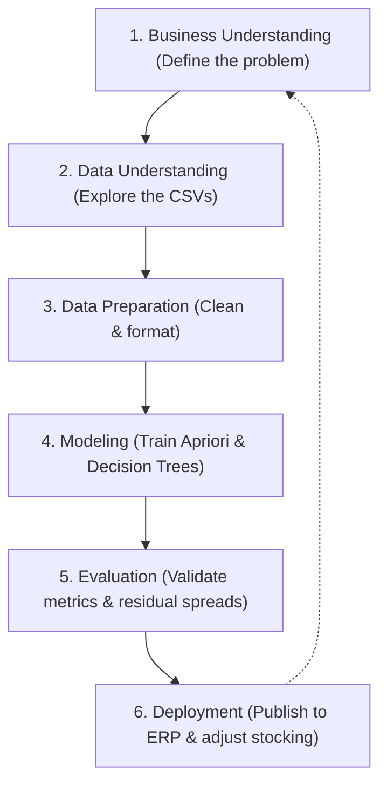

# VacuTech — Business Intelligence & Data Mining Handbook

**Programme:** Bachelor of Science in Business Intelligence (B.Sc. BI) — First Semester Guide  
**Course Module:** DLMDSEBA02 — Data Mining & Business Intelligence  
**Case Study:** Data-Driven Process Optimization at VacuTech Solutions  
**Repository:** [jaysplen/bi1_project_v3](https://github.com/jaysplen/bi1_project_v3)

---

## 1. Introduction for BI B.Sc. Students

Welcome to your first real-world Business Intelligence (BI) and Data Mining case study! As a first-semester B.Sc. BI student, you might wonder: *What is the difference between data engineering, machine learning, and business intelligence?* 

This handbook is designed to show you exactly how these fields connect. Business Intelligence is not just about creating colorful dashboards; it is about **translating data into actionable business decisions**. In this project, we analyze the after-sales maintenance workflow of **VacuTech Solutions**—a high-tech vacuum equipment supplier. 

Currently, VacuTech’s repair process suffers from three operational bottlenecks:
1. **Parts delays**: Technicians discover they need extra, unplanned parts, causing repair delays.
2. **Uncertain scheduling**: Service planners cannot give customers a reliable completion date.
3. **Quality issues**: Repaired pumps fail final Quality Assurance (QA) tests, forcing expensive rework loops.

To solve these, we apply the industry-standard **CRISP-DM** lifecycle and build three interpretable, transparent models (W1, W2, W3). Each model targets a specific customer relationship management (CRM) goal. Let's explore how we do this and, most importantly, **why** we chose these specific methods.

---

## 2. The CRISP-DM Framework: Our Analytical Roadmap

Before writing any code, professional BI analysts follow a structured project roadmap called **CRISP-DM** (Cross-Industry Standard Process for Data Mining). It divides a data project into six cyclical phases:



In this project, we follow this framework meticulously:
* **Business Understanding**: We align each work package (W) with a concrete CRM pain point.
* **Data Understanding**: We load and inspect three central tables (`repairs.csv`, `parts_used.csv`, and `parts.csv`).
* **Data Preparation**: We filter out irrelevant rows, handle missing values, and encode text columns into numbers so the models can read them.
* **Modeling**: We apply one simple, highly interpretable algorithm per business question.
* **Evaluation**: We evaluate models using separate "test data" (data the model has never seen during training) to ensure they will perform reliably in production.
* **Deployment**: We translate our technical metrics into clear standard operating procedures (SOPs) for the workshop manager.

---

## 3. Live Pipeline Metrics Summary

Professional BI relies on **reproducibility**—the ability to re-run the pipeline and get identical, verifiable results. The metrics below are automatically injected from our active data pipeline (`exports/metrics_summary.json`):

<!-- METRICS -->

*To regenerate these metrics and rebuild this document, follow the commands outlined in Section 8.*

---

## 4. W1 — Spare Parts Bundling & Stocking (Apriori Rules)

### The Business Problem & CRM Value
When a technician is repairing a pump, discoverability delays occur if a critical part is missing from local inventory. This forces a second trip, increases repair duration, and erodes customer trust. 
* **CRM Objective**: Customer Development — Maximize first-visit completion rates.
* **Core Question**: *Which additional parts frequently co-occur (break together) across all repairs completely independently of whether it is a preventive maintenance or breakdown job, so that we can pre-stock or bundle them to replace them in every repair where one is flagged?*

### The Data Mining Method: Apriori Association Rules
To find which parts "co-occur" (are consumed together), we use the **Apriori algorithm**. You might know this as "Market Basket Analysis"—the same technology Amazon uses to say *"Customers who bought this also bought..."*. 

We represent every repair case as a "shopping basket" of parts. If a part was used, we flag it as `True`; if not, `False`.
> **Critical Data Rule**: Standard maintenance kit parts (flagged with `kit_part_flag = 1`) are strictly **excluded** from W1. Since standard kits are already pre-stocked, we only analyze independent/add-on parts (`kit_part_flag = 0`) to discover new bundling rules.

To evaluate rules, Apriori uses three fundamental statistics:
1. **Support**: How frequently the part combination appears in the entire dataset.
   $$\text{Support}(A \rightarrow B) = \frac{\text{Cases containing both } A \text{ and } B}{\text{Total Cases}}$$
   *Why it matters*: If support is too low, the rule is too rare to be worth stocking.
2. **Confidence**: The probability that part $B$ is needed when part $A$ is used.
   $$\text{Confidence}(A \rightarrow B) = \frac{\text{Support}(A \cup B)}{\text{Support}(A)}$$
   *Why it matters*: 80% confidence means that in 8 out of 10 repairs needing part $A$, the technician will also need part $B$.
3. **Lift**: How much more likely parts are needed together compared to pure random chance.
   $$\text{Lift}(A \rightarrow B) = \frac{\text{Support}(A \cup B)}{\text{Support}(A) \times \text{Support}(B)}$$
   *Why it matters*: A Lift of $1.0$ means $A$ and $B$ are completely independent. A Lift of $12.0$ means they are strongly bound together (technically, they co-occur 12 times more than chance!).

### The Pareto Principle (80/20 Rule)
Alongside Apriori, we plot a **Pareto Chart**. In Business Intelligence, the Pareto Principle states that roughly **80% of consequences come from 20% of causes**. Here, we discover that a tiny handful of high-demand parts account for the vast majority of our add-on inventory demand.

### Results & Business Implications
* **Live Pareto Result**: The Pareto chart shows that stocking just **26 unique SKUs** (out of 177 total parts) satisfies **80% of all add-on inventory demand**.
* **Actionable Recommendation**: The operations manager should instantly stock these 26 Pareto-head SKUs at all regional warehouses. Furthermore, high-lift association rules (e.g. particular seals and washers) should be pre-packaged into physical "add-on bundles" for specific pump series, avoiding parts-sourcing delays entirely.

---

## 5. W2 — Predicting Repair Durations (Decision Tree Regression)

### The Business Problem & CRM Value
When a customer sends a pump for repair, they need a reliable completion date (ETA) to schedule their own production downtime. Currently, service planners give vague, unreliable estimates.
* **CRM Objective**: Customer Retention — Deliver credible promises and reduce status-check phone calls.
* **Core Question**: *Given what we know at intake (pump model, age, failure type, sourcing, and assigned tech), how long will this repair take?*

### The Machine Learning Method: Decision Tree Regressor
In machine learning, **Regression** means predicting a continuous numerical value (such as the number of days a repair will take). We chose a **Decision Tree Regressor** for W2 because of its ultimate **interpretability**. 

Unlike a "black-box" model (like a Neural Network or Support Vector Machine) which gives a prediction without explanation, a Decision Tree behaves like a clear flowchart:
1. It asks a series of binary questions (e.g., *Is the complexity High?*).
2. It splits the data into branches based on the answers.
3. At the end of the branch (a leaf node), it calculates the average duration of historical cases that took that exact path.
This structure is so simple that a front-desk service advisor can explain the prediction directly to a customer on a whiteboard.

### Business-Friendly Evaluation Metrics
To measure how well our model performs on held-out test data, we track three standard metrics:
* **Model Reliability ($R^2$)**: Represents the percentage of scheduling variation explained by our model. An $R^2$ of **92.7%** means our model successfully captures almost all operational drivers of repair time.
* **Avg. Prediction Error (MAE)**: Mean Absolute Error tells us that, on average, our estimates are off by only **1.1 days**.
* **Risk Buffer Margin (RMSE)**: Root Mean Squared Error penalizes larger errors more heavily. Our RMSE of **2.2 days** serves as a natural "worst-case" buffer.

### Operational Discovery: Predictable vs. Unpredictable Repairs
By analyzing our model's prediction errors (residuals), we uncovered a critical business finding:
* **Predictable Repairs**: Maintenance categories like `'Contamination'` and `'Overheating'` have extremely narrow prediction errors (low variance). We can confidently quote a standard **±1-day window** on customer receipts.
* **Unpredictable Repairs**: Categories like `'Control electronics'` and `'Seal/Leak'` exhibit unusually high variance (prediction errors spread widely up to 4.8 days).
* **Actionable Recommendation**: Quote a wider **±4-day scheduling buffer** specifically for electronics/leak jobs to protect customer trust. Concurrently, operations should establish tightly standardized Standard Operating Procedures (SOPs) for these two highly variable categories to reduce workshop floor unpredictability.

---

## 6. W3 — Quality Assurance Risk Triage (Decision Tree Classification)

### The Business Problem & CRM Value
If a pump fails its final Quality Assurance (QA) inspection, it must be sent back for rework. This duplicates labor costs, extends turnaround times, and—if a faulty pump accidentally slips through—severely damages customer trust.
* **CRM Objective**: Customer Loyalty — Intercept quality issues early and prevent repeat-failure cycles.
* **Core Question**: *Which job characteristics (such as pump models and technician work experience) predict quality failures at intake, so that high-risk cases can be flagged early for senior review?*

### Dropping "Repair Duration" to Avoid Data Leakage
In W3's model, we dropped `repair_duration_days` from the features (`W3_NUMERIC`). This solves the data leakage/timing issue and transforms W3 into a true **intake-time triage system**. We only use information available at the exact moment the prediction is made (at booking/intake).

### The Machine Learning Method: Decision Tree Classifier & Triage Threshold
Since we are predicting a category (1 = QA Fail, 0 = QA Pass), this is a **Classification** task. We use a **Decision Tree Classifier** with an optimized **Operating Threshold of 30%**:
* Traditional classifiers flag an alert if the predicted risk is > 50%.
* However, QA failures are relatively rare (~13% in our 10,000-case dataset) but highly expensive.
* By setting our alert trigger at **30% risk**, we deliberately prioritize safety, ensuring we capture a large portion of failures while keeping the review workload highly manageable for senior staff.

### Understanding the Classification Metrics
* **Failures Caught (Recall)**: The percentage of true quality failures successfully flagged by our model. Our model achieves **49% Recall** at intake.
* **Alert Accuracy (Precision)**: The percentage of flagged cases that turn out to be true failures (**43% Precision**). Since our primary goal is preventing failure slip-throughs, we accept minor "false alarms" (flagging a pump that ultimately passes QA) to guarantee quality.
* **Overall Triage Accuracy**: The percentage of all predictions (flagged and unflagged) that are correct (**85.2%**).

### Results & Business Implications
* **Triage Guidelines**: Our Decision Tree automatically identified specific pump models—namely **`'T1200'`** and **`'G400D'`**—as carrying highly elevated quality risks (48% and 38% failure rates, respectively).
* **Actionable Recommendation**: Route all jobs for pump models `'T1200'` and `'G400D'` through a **mandatory senior technician sign-off** at intake. Conversely, low-risk models (e.g. `'G200D'` and `'R300'`) should run on an automated fast-track QA queue, maximizing shop floor throughput and technician efficiency.

---

## 7. Analytical Summary for BI Students

To summarize our data mining and ML architecture, review this consolidated summary:

| Phase | Work Package 1 (W1) | Work Package 2 (W2) | Work Package 3 (W3) |
|---|---|---|---|
| **Business Value** | Parts Stocking & Bundling | Smart Workshop Scheduling | Quality Triage & Risk Control |
| **Model Type** | Descriptive Data Mining | Continuous Regression | Binary Classification |
| **Algorithm** | Apriori Association Rules | Decision Tree Regressor | Decision Tree Classifier |
| **Core Finding** | Stocking **26 head SKUs** covers **80% of add-on demand** across all repairs. | `'Control electronics'` and `'Seal/Leak'` are highly unpredictable. | Models `'T1200'` and `'G400D'` carry **38%–48% QA fail rates**. |
| **SOP Action** | Pre-stock Pareto head SKUs; bundle high-lift co-occurring items. | Quote standard ±1 day; quote ±4 days for electronics/leaks. | Mandatory senior tech review for high-risk models; fast-track low-risk models. |

---

## 8. Step-by-Step Reproduction Commands

To replicate this entire B.Sc. Business Intelligence project end-to-end, execute the following commands from your terminal:

```bash
# 1. Initialize python virtual environment and activate
python3 -m venv .venv
source .venv/bin/activate

# 2. Install all required data science libraries
pip install -r requirements.txt

# 3. Run the analytical pipeline (trains W1, W2, W3 models and exports metrics)
python3 bi_pipeline.py

# 4. Programmatically re-execute the CRISP-DM Jupyter notebooks in place
python3 -c "import nbformat; from nbconvert.preprocessors import ExecutePreprocessor; ep = ExecutePreprocessor(timeout=600, kernel_name='python3'); [open(nb, 'w').write(nbformat.writes(ep.preprocess(nbformat.read(open(nb), as_version=4), {'metadata': {'path': '.'}})[0])) for nb in ['notebooks/W1_Inventory.ipynb', 'notebooks/W2_Repair_Duration.ipynb', 'notebooks/W3_QA_Failure_Risk.ipynb']]"

# 5. Rebuild this printable handbook PDF (embeds live pipeline KPIs)
python3 build_handbook.py

# 6. Rebuild the 10-slide management presentation deck (PPTX + PDF)
python3 build_presentation.py

# 7. Run the automated smoke test suite to verify code correctness
python3 -m pytest tests/ -v
```

By following these CRISP-DM stages, you have successfully transformed raw workshop logs into highly strategic, governable business rules—proving the massive value of a B.Sc. in Business Intelligence!
